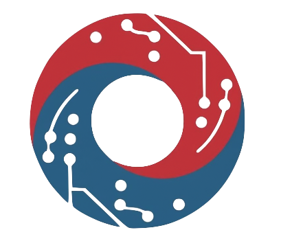
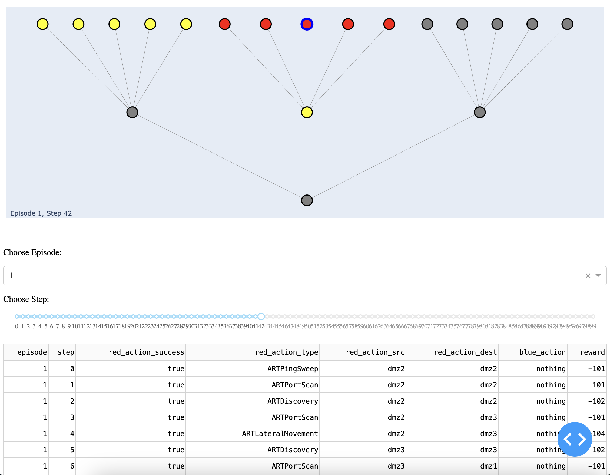

<a id="readme-top"></a>

[![Issues][issues-shield]][issues-url]
[![MIT License][license-shield]][license-url]

<!-- PROJECT LOGO -->
<br />
<div align="center">
  <a href="https://github.com/ORNL/cyberwheel">
    
  </a>

  <h3 align="center">Cyberwheel</h3>

  <p align="center">
    A reinforcement learning simulation environment focused on autonomous cyber defense
    <br />
    <br />
    <a href="https://github.com/ORNL/cyberwheel/issues/new">Submit Issue</a>
  </p>
</div>


<!-- TABLE OF CONTENTS -->
<details>
  <summary>Table of Contents</summary>
  <ol>
    <li>
      <a href="#about-cyberwheel">About Cyberwheel</a>
      <ul>
        <li><a href="#built-with">Built With</a></li>
      </ul>
    </li>
    <li>
      <a href="#getting-started">Getting Started</a>
      <ul>
        <li><a href="#prerequisites">Prerequisites</a></li>
        <li><a href="#installation">Installation</a></li>
      </ul>
    </li>
    <li><a href="#usage">Usage</a></li>
    <li><a href="#license">License</a></li>
    <li><a href="#contacts">Contacts</a></li>
  </ol>
</details>

## About Cyberwheel

<!-- TODO: What would be a good project image? -->
<!--  -->

Cyberwheel is a Reinforcement Learning (RL) simulation environment built for training and evaluating autonomous cyber defense models on simulated networks. It was built with modularity in mind, to allow users to build on top of it to fit their needs. It supports various robust configuration files to build networks, services, host types, defensive agents, and more.

Motivations:
* Extensibility - allowing for modifying and adding various defensive actions and offensive strategies without requiring structural changes to codebase.
* Scalability - supporting training on large networks with minimal performance cost

This environment contains a training script and evaluation script with a large set of configurable parameters to switch out networks, strategies, episode lengths, and more. It also contains a script to run a dash server that allows for the evaluations to be visualized in a readble graph display showing agent actions througout the episodes.

<p align="right">(<a href="#readme-top">back to top</a>)</p>

### Built With

* [![Python][python]][python-url]
* [![Poetry][poetry]][poetry-url]
* [![Gym][gym]][gym-url]
* [![W&B][wandb]][wandb-url]
* [![Dash][plotly-dash]][plotly-dash-url]

<p align="right">(<a href="#readme-top">back to top</a>)</p>

## Getting Started

### Prerequisites

* python==3.10

This project runs on, and has been tested with, Python 3.10. Once installed, poetry should automatically use this version for its virtual environment.

* poetry

Cyberwheel uses poetry to manage and install python packages. For instructions on how to install poetry, visit their [installation page](https://python-poetry.org/docs/#installation).

* graphviz

For the dash server visualization to function, you need graphviz, an open source graph visualization software, installed on your system.

Instructions for installing graphviz can be found in their [documentation](https://graphviz.org/download/).

### Installation

Once all dependencies are installed:

1. If you haven't already, clone the cyberwheel repo with HTTPS
   ```sh
   git clone https://github.com/ORNL/cyberwheel.git
   ```
   or with SSH:
   ```sh
   git clone git@github.com:ORNL/cyberwheel.git
   ```
2. Install packages and resolve dependencies
    ```sh
    poetry install
    ```

*On newer OSX systems running on silicone chips, there may be an error installing the `pygraphviz` package, with poetry not finding the graphviz configuration files. You can work around this by pip installing the pygraphviz package manually, explicitly passing graphviz config paths. [This link](https://stackoverflow.com/a/70439868) helped me work through this issue.*

<p align="right">(<a href="#readme-top">back to top</a>)</p>

<!-- USAGE EXAMPLES -->
## Usage

To run any cyberwheel scripts, shell into the poetry virtual environment
```sh
poetry shell
```
When you want to deactivate the environment, you can just hit Ctrl+D. This will exit the virtual environment shell.

### Training a model

To train a model on our environment, you can use our training script, `train_cyberwheel.py`

```sh
python3 train_cyberwheel.py
```

This will run training with default parameters. It will save the model during evaluations in the `models/` directory. If tracking to Weights & Biases, the model and its checkpoints will be saved on your W&B project, as well as locally. You can also view real-time training progress on your W&B account.

The script also includes a wide array of configuration options as arguments that can be passed.

<ins>Training Parameters<ins>

  * `--exp-name EXP_NAME`:  name of this experiment
  * `--seed SEED`: seed of the experiment
  * `--torch-not-deterministic`: if toggled, `torch.backends.cudnn deterministic=False`
  * `--device DEVICE`: Choose device for training: `cpu` | `cuda` | `cuda:GPU_NUM`
  * `--async-env`: if toggled, trains with asynchronous environments
  * `--track`: if toggled, this experiment will be tracked with Weights and Biases
    * `--wandb-project-name WANDB_PROJECT_NAME`: the wandb's project name
    * `--wandb-entity WANDB_ENTITY`: the entity (team) of wandb's project
  * `--total-timesteps TOTAL_TIMESTEPS`: total timesteps for training
  * `--num-saves NUM_SAVES`: the number of model saves/evaluations throughout training
  * `--num-envs NUM_ENVS`: the number of parallel game environments
  * `--num-steps NUM_STEPS`: the number of steps to run in each environment per episode
  * `--eval-episodes EVAL_EPISODES`: Number of evaluation episodes to run

<ins>Environment Parameters<ins>

  * `--red-agent RED_AGENT` the red agent to train against
  * `--red-strategy RED_STRATEGY`: the red agent strategy to train against
  * `--network-config NETWORK_CONFIG`: Input the network config filename
  * `--decoy-config DECOY_CONFIG`: Input the decoy config filename
  * `--host-config HOST_CONFIG`: Input the host config filename
  * `--blue-config BLUE_CONFIG`: Input the blue agent config filename
  * `--min-decoys MIN_DECOYS`: Minimum number of decoys for blue agent to deploy
  * `--max-decoys MAX_DECOYS`: Maximum number of decoys for blue agent to deploy
  * `--reward-function REWARD_FUNCTION`: Which reward function to use
  * `--reward-scaling REWARD_SCALING`: Variable used to increase rewards
  * `--detector-config DETECTOR_CONFIG`: Location of detector config file.

<ins>Reinforcement Learning Parameters<ins>

  * `--env-id ENV_ID`: the id of the environment
  * `--learning-rate LEARNING_RATE`: the learning rate of the optimizer
  * `--anneal-lr`: Toggle learning rate annealing for policy and value networks
  * `--gamma GAMMA`: the discount factor gamma
  * `--gae-lambda GAE_LAMBDA`: the lambda for the general advantage estimation
  * `--num-minibatches NUM_MINIBATCHES`: the number of mini-batches
  * `--update-epochs`: UPDATE_EPOCHS the K epochs to update the policy
  * `--norm-adv [NORM_ADV]`: Toggles advantages normalization
  * `--clip-coef CLIP_COEF`: the surrogate clipping coefficient
  * `--clip-vloss`: Toggles whether or not to use a clipped loss for the value function
  * `--ent-coef ENT_COEF`: coefficient of the entropy
  * `--vf-coef VF_COEF`: coefficient of the value function
  * `--max-grad-norm MAX_GRAD_NORM`: the maximum norm for the gradient clipping
  * `--target-kl TARGET_KL`: the target KL divergence threshold

<p align="right">(<a href="#readme-top">back to top</a>)</p>

### Evaluating a model

To evaluate a trained model with Cyberwheel, you can use our evaluation script, `evaluate_cyberwheel.py`

```sh
python3 evaluate_cyberwheel.py --experiment [exp-name]
```

This will run evaluation with default parameters on a trained model by its experiment name. It will load the model from the `models/` directory. If tracked to Weights & Biases, the model and its checkpoints can be loaded from your W&B project as well.

The script also includes a wide array of configuration options as arguments that can be passed.

<ins>Evaluation Parameters<ins>

  * `--download-model`: If toggled, downloads agent model file from WandB. If present, requires --run --wandb-entity, --wandb-project-name flags.
    * `--wandb-entity WANDB_ENTITY`: Username where W&B model is stored. Required when downloading model from W&B
    * `--wandb-project-name WANDB_PROJECT_NAME`: Project name where W&B model is stored. Required when downloading model from W&B
    * `--run RUN`: Run ID from WandB for pretrained blue agent to use. Required when downloading model from W&B
  * `--checkpoint CHECKPOINT`: Filename (excluding extension) for checkpoint of the trained model to evaluate, by globalstep. Defaults to 'agent' (latest).
  * `--red-agent RED_AGENT`: Red agent to evaluate with
  * `--red-strategy RED_STRATEGY`: Red agent strategy to evaluate with
  * `--blue-config BLUE_CONFIG`: Input the blue agent config filename
  * `--experiment EXPERIMENT`: Experiment name of trained agent model
  * `--visualize`: Stores visualization of network at each step/episode. Can be viewed in dash server.
  * `--graph-name GRAPH_NAME`: Override naming convention of graph storage directory.
  * `--network-config NETWORK_CONFIG`: Input the network config filename
  * `--decoy-config DECOY_CONFIG`: Input the decoy config filename
  * `--host-config HOST_CONFIG`: Input the host config filename
  * `--detector-config DETECTOR_CONFIG`: Path to detector config file
  * `--min-decoys MIN_DECOYS`: Minimum number of decoys that blue agent should deploy
  * `--max-decoys MAX_DECOYS`: Maximum number of decoys that blue agent should deploy
  * `--reward-scaling REWARD_SCALING`: Variable used to increase rewards
  * `--reward-function REWARD_FUNCTION`: Which reward function to use.
  * `--num-steps NUM_STEPS`: Number of steps per episode to evaluate
  * `--num-episodes NUM_EPISODES`: Number of episodes to evaluate

<p align="right">(<a href="#readme-top">back to top</a>)</p>

### Visualization

To view the visualizations of the evaluations that were run, you can run the visualization script:
```sh
python3 run_visualization_server.py [PORT_NUM]
```
This will run a dash server locally on the port number passed. You can then visit `http://localhost:PORT_NUM/` to access the frontend. From here, you can find the evaluation you ran in the list, and view the network state over the course of each episode with a step slider.


## Cyberwheel Design

### Network Design

Networks in Cyberwheel are comprised of routers, subnets, and hosts represented as nodes in a networkx graph​.
* Routers manage network traffic between Subnets.
* Subnets represent the broadcast domain​ and manage network traffic between Hosts.
* Hosts are machines/devices that belong to a subnet​, and they contain list of running services with ports, CVEs, and other attributes.
 ​Cyberwheel builds networks from a config YAML file.

### Blue Agent Design

The blue agent is largely focused on deploying Decoys to slow and/or stop red agent attacks throughout the network. The blue agent's actions and logic be configured and defined in a YAML file, allowing for greater modularity.

### Red Agent Design

The red agent is a heuristic agent that has a set of defined rules and strategies that it can use to traverse a network, although its behavior to dictate which Hosts it chooses to target is modular. It's actions are mapped from MITRE ATT&CK Killchain Phases (Discovery, Lateral Movement, Privilege Escalation, Impact) to Atomic Red Team (ART) techniques. We've defined these techniques with a set of attributes mapped from existing cyber attack data. This allows our ART Agent to run a higher level killchain phase (i.e. discovery) on a host, and the environment will cross-reference the target host's attributes with ART Technique attributes. Techniques are valid for the attack by checking:
  - [x] Technique includes the target host's OS in its supported platforms
  - [x] Technique includes the killchain phase in its supported killchain phases
  - [x] Technique can exploit any CVE that is present on the target host

If all of these conditions are met, the agent can successfully run the killchain attack on the host. These ART Techniques include Atomic Tests, which give tangible commands to run in order to execute the given attack. With this methodology, the simulator is able to transform a general killchain phase into a valid set of commands that could be run in
the real world.

<ins> Example <ins>

1. ART Agent runs `Privilege Escalation` on Host.
2. ART Agent runs OS, Killchain Phase, and CVE checks.
3. ART Agent uses ART Technique: DLL Side-Loading Technique
4. ART Agent chooses a random Atomic Test
5. Atomic Test adds the following commands to Host metadata:
```sh
New-Item -Type Directory (split-path "${gup_executable}") -ErrorAction ignore | Out-Null​
Invoke-WebRequest "https://github.com/redcanaryco/atomic-red-team/blob/master/atomics/T1574.002/bin/GUP.exe?raw=true" -OutFile "${gup_executable}"
if (Test-Path "${gup_executable}") {exit 0} else {exit 1}​
"${gup_executable}”​
taskkill /F /IM ${process_name} >nul 2>&1​
```

### Detectors and Alerts

Red actions produce Alerts which contain information such as the actions's source host, target host, exploited services, and techniques. The blue agent has a detector layer set up with Alerts that detect any red agent action on the network. These detectors can filter out Alerts, add noise, or even create false-positive Alerts. You can use multiple detectors together to capture various red agent behavior. These alerts are then converted into the observation space which the RL agent uses to train.

### Configurations

All configurations are stored in the `resources/configs` directory. You can use config to define blue agents, decoy types, detectors, host types, networks, and services.

<!-- CONTRIBUTING -->
## Contributing

If you are not familiar with SOLID principles, please read this before contributing. Pretty basic, but makes a huge difference down the road --- [Article on SOLID](https://medium.com/@iclub-ideahub/the-solid-principles-a-guide-to-writing-maintainable-and-extensible-code-in-python-ecac4ea8d7ee).

If you need to add a dependency, this project is packaged with [poetry](https://python-poetry.org/). Please take a few minutes to read about the [basics](https://python-poetry.org/docs/basic-usage/#specifying-dependencies) before adding any dependencies. Do not use pip, do not use requirements.txt. TLDR: use `poetry add <dependency name>`. After adding your dependency, add and commit the new `poetry.lock` file.

This project uses pre-commit to automatically run formatting prior to every commit. Pyright is included in this suite and _will_ block your commit if you commit code with bad type labels. If you'd like to skip this check, run `SKIP=pyright git commit <rest of commit command>`.

If you need to do anything with the networkx graph, write helper functions in the network module (base class where possible) rather than passing the graph around / injecting it wherever possible. Of course you may have to inject the network instance since it holds the state information.

The cyberwheel class that inherits from gym should contain minimal code to keep it clean. If you find yourself writing long code blocks in this file, consider whether they should be moved into another module or class. The same thing goes for the main class --- keep it clean. If you want to add 30 command line args, maybe find a way to parse them using a helper class just to keep that file clean.

Be creative and have fun!

<p align="right">(<a href="#readme-top">back to top</a>)</p>

<!-- LICENSE -->
## License

Distributed under the MIT License. See `LICENSE` for more information.

<p align="right">(<a href="#readme-top">back to top</a>)</p>

<!-- CONTACT -->
## Contacts

Sean Oesch - oeschts@ornl.gov

Cory Watson - watsoncl1@ornl.gov

Amul Chaulagain - chaulagaina@ornl.gov

Matthew Dixson - dixsonmk@ornl.gov

Brian Weber - weberb@ornl.gov

Phillipe Austria - austriaps@ornl.gov

Project Link: [https://github.com/ORNL/cyberwheel/](https://github.com/ORNL/cyberwheel/)

<p align="right">(<a href="#readme-top">back to top</a>)</p>

<!-- MARKDOWN LINKS & IMAGES -->
[issues-shield]: https://img.shields.io/github/issues/ORNL/cyberwheel.svg?style=for-the-badge
[issues-url]: https://github.com/ORNL/cyberwheel/issues
[license-shield]: https://img.shields.io/github/license/othneildrew/Best-README-Template.svg?style=for-the-badge
[license-url]: https://github.com/ORNL/cyberwheel/blob/main/LICENSE

[plotly-dash]: https://img.shields.io/badge/plotly-dash-000000?style=for-the-badge&logo=plotly&logoColor=white
[plotly-dash-url]: https://dash.plotly.com/
[python]: https://img.shields.io/badge/python-000000?style=for-the-badge&logo=python&logoColor=white
[python-url]: https://www.python.org/
[wandb]: https://img.shields.io/badge/W&B-000000?style=for-the-badge&logo=weightsandbiases&logoColor=white
[wandb-url]: https://wandb.ai/site
[gym]: https://img.shields.io/badge/gym-000000?style=for-the-badge&logo=openaigym&logoColor=white
[gym-url]: https://github.com/Farama-Foundation/Gymnasium
[poetry]: https://img.shields.io/badge/poetry-000000?style=for-the-badge&logo=poetry&logoColor=white
[poetry-url]: https://python-poetry.org/
